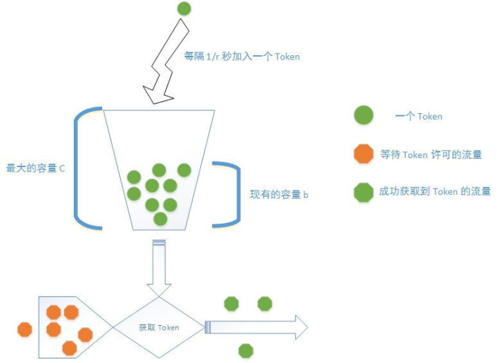

# 限流

> [token bucket](https://zhuanlan.zhihu.com/p/20872901)

## 场景

有时候我们遇到有流量限制的场景如：

    1、在每分钟错误计数达到250时发送消息。
    2、消费队列任务的速率控制
    3、控制登录或请求的频率
    4、api 的调用次数限制

这种时候我们一般有一下几种方案去实现：

- 基于信号量：Semaphore

>只有数量维度，没有时间维度

- 基于fixed window

>带上了时间维度，不过在两个窗口的临界点容易出现超出限流的情况，比如限制每分钟10个请求，在00:59请求了10次，在01:01又请求了10次，而从00:30-01:30这个时间窗口来看，这一分钟请求了20次，没有控制好

- 基于rolling window

>就是要解决fixed window没解决的窗口临界问题，主要有基于token bucket的算法，以及基于leaky bucket的算法

## 基于信号量实现

信号量就相当于是一个计数器。当有进程对它所管理的资源进行请求时，进程先要读取信号量的值，大于0，资源可以请求，等于0，资源不可以用，这时进程会进入睡眠状态直至资源可用。当一个进程不再使用资源时，信号量+1(对应的操作称为V操作)，反之当有进程使用资源时，信号量-1(对应的操作为P操作)。对信号量的值操作均为`原子操作`。

### 常见的一类问题：生产者、消费者

有一个或者多个生产者往缓冲区放置数据；有一个消费者从缓冲区中取数据。为避免对缓冲区的重复操作，任何时候只有一个主题访问缓冲区。

### 哲学家进餐问题


## 基于 fixed window

### api 限流的解决方案

在开发接口服务器的过程中，为了防止客户端对于接口的滥用，保护服务器的资源， 通常来说我们会对于服务器上的各种接口进行调用次数的限制。比如对于某个 用户，他在一个时间段（interval）内，比如 1 分钟，调用服务器接口的次数不能够 大于一个上限（limit），比如说 100 次。如果用户调用接口的次数超过上限的话，就 直接拒绝用户的请求，返回错误信息。

### 伪代码

```
can_access(identity):
    limit_counter = get(identity)
    if limiter_counter exists and
        limiter_counter.timestamp - CURRENT_TIME < LIMIT_INTERVAL and
        limit_counter >= limit:
        return false
    else
        if limiter_counter is nil or
            (limit_counter exists and limiter_counter.timestamp - CURRENT_TIME > LIMT_INTERVAL):
            put(identity, new LimiterCounter(1, CURRENT_TIME))
        else
            put(identity, limiter_counter.increment())
        end
        return true
    end
```

### 缺陷

用户可以在一个时间段的末尾发起 Q 次请求，然后在下一个时间段的开始又 发起 Q 次请求，这样，一个用户可以在很短的时间之内发起 2Q 次请求。

可能普通用户不会刻意这么去做，但如果真的出现这种情况的时候，服务器会承受正常情况下两倍的负载， 这并不是我们所希望看见的。而且如果服务器被攻击的话，这种的缺陷，还是很可能会被利用的。


## 基于rolling window： token bucket

 令牌桶算法基于以下三个特点：

    1、所有的流量在放行之前需要获取一定量的 token
    2、所有的 token 存放在一个 bucket（桶）当中，每 1/r 秒，都会往这个 bucket 当中加入一个 token；
    3、bucket 有最大容量（capacity or limit），在 bucket 中的 token 数量等于最大容量，而且没有 token 消耗时，新的额外的 token 会被抛弃。

可以将这个算法类比成有个水龙头在往水桶中放水，然后不断地有水瓢到这个水桶中打水去浇花，如果水桶的水满了，那么 水就从水桶中溢出了。



### 限流策略配置

服务器一般会有多种限制流量的策略进行组合，如：

- 对于每个登录过的用户，服务器规定 10 秒内，用户的请求次数不能超过 200 次；而且，1 小时内，用户的请求次数不能超过 5000 次；并且，1 天内， 用户的请求次数不能超过 20000 次。这样，对于每个用户都需要设置三个 bucket。

- 另外服务器还规定服务器所有的接口在 10 秒内，请求次数不能超过 100000 次，这种情况下，所有用户会共享一个全服务器的 token bucket。

- 还有可能根据 IP 进行限制，这样 bucket 就需要根据 IP 地址进行创建。

所以当一个请求到达服务器的时候，首先需要根据请求的各种信息，确定其需要获取哪个 bucket 的 Token，接着，这个请求去对应的 token bucket 获取允许通行的 token，如果没有获取到 token，服务器最好的做法是直接返回流量超过限制的响应（429）。 如果获取到相应的 token，那么就对于请求给予放行。

### 实现

#### 不好的实现：

对于每个 Bucket 设置一个定时器，每过一个间隔，就往这个 Bucket 当中加入一些 Token，然后用户 获取一个 Token 之后，就将 Bucket 中的 Token 数量减一。

这种实现算法需要给每个 Bucket 添加 一个定时器，而一个定时器就是一条线程。那么在你的服务器上，光是分配给定时器的线程就需要和你的用户数量是一个量级的， 几万几十万条线程在服务器上运行，是完全是脱离了实际情况的。

#### 另外一种实现机制：时间戳

我们可以在 Bucket 中存放现在的 Token 数量，然后存储上一次补充 Token 的时间戳，当用户下一次请求获取一个 Token 的时候， 根据此时的时间戳，计算从上一个时间戳开始，到现在的这个时间点所补充的所有 Token 数量，加入到 Bucket 当中。

使用这个方法的优势：

- 首先, 避免了给每一个 Bucket 设置一个定时器这种笨办法
- 数据结构需要的内存量很小，只需要储存 Bucket 中剩余的 Token 量以及上次补充 Token 的时间戳就可以了；
- 只有在用户访问的时候，才会计算 Token 补充量，对于系统的计算资源占用量也较小。


#### 具体实现

实现流程如下

    1、当一个请求 Token进入 access() 方法后，先计算计算该请求的 Token Bucket 的 key；
    2、如果这个 Token Bucket 在 Redis 中不存在，那么就新建一个 Token Bucket，然后设置该 Bucket 的 Token 数量为最大值减一(去掉了这次请求获取的 Token）。 在初始化 Token Bucket 的时候将 Token 数量设置为最大值这一点在后面还有讨论；
    3、如果这个 Token Bucket 在 Redis 中存在，而且其上一次加入 Token 的时间到现在时间的时间间隔大于 Token Bucket 的 interval，那么也将 Bucket 的 Token 值重置为最大值减一；
    4、如果 Token Bucket 上次加入 Token 的时间到现在时间的时间间隔没有大于 interval，那么就计算这次需要补充的 Token 数量，将补充过后的 Token 数量更新到 Token Bucket 中。

这个方法在单线程下基本没什么问题。

#### 竞争问题

增加锁机制